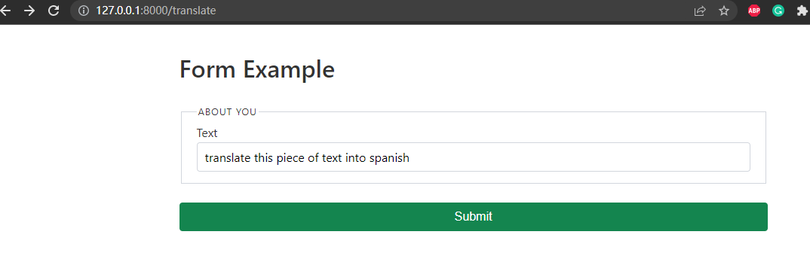
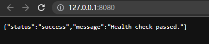
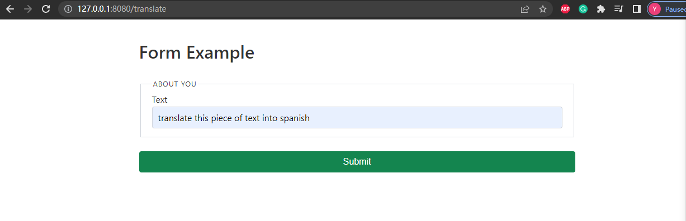
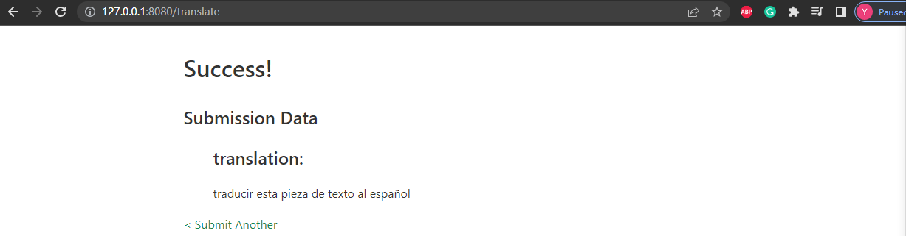
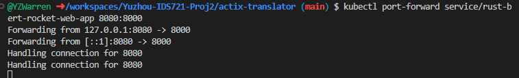

# Project2: Rocket Web App built on rust-bert translation models
Deployed on: 

## Containerization
1. In [Dockerfile](https://github.com/nogibjj/Yuzhou-IDS721-Proj2/blob/main/actix-translator/Dockerfile), configure containerization
2. Build docker with `docker build -t rust-bert-rocket .`
3. Test docker containerized app with `docker run -p 8000:8000 rust-bert-rocket`

## Deployment on Kubernetes

0. Prerequisite: make sure you have `docker`, `minikube` installed in machine

    To build codespace with `docker` and `minikube`: go to .devcontainer/devcontainer.json, add following text: 

    ``` 
    "features": {
		"ghcr.io/devcontainers/features/kubectl-helm-minikube:1": {},
		"ghcr.io/devcontainers/features/docker-in-docker:2": {}
	},
    ```
    
    And start a new codespace with .devcontainer/devcontainer.json as config file
1.  Push container to DockerHub (Optional): i.e. 

    `docker login -u "myusername" -p "mypassword" docker.io` to login if haven't logged in in terminal

    If haven't build image, build with tag: `docker build -t <hub-user>/<repo-name>[:<tag>]` i.e. `docker build -t yzwarren/rust-kube:latest`

    If already built, tag with: `docker tag <already-built-image> <hub-user>/<repo-name>[:<tag>]` i.e. `docker tag calculator yzwarren/rust-kube:latest`

    Push with `docker push <hub-user>/<repo-name>:<tag>`

    Example of a pushed Rust actix container here:  https://hub.docker.com/repository/docker/yzwarren/rust-bert-rocket-kube

2. `minikube start`
3. `minikube dashboard --url`
4. Hover over link and "follow link"
5. Create a deployment: `kubectl create deployment rust-bert-rocket-web-app --image=registry.hub.docker.com/yzwarren/rust-bert-rocket-kube`
6. View deployment: `kubectl get deployments`
7. Create service and expose port 8000: `kubectl expose deployment rust-bert-rocket-web-app --type=LoadBalancer --port=8000`
8. View services:  `kubectl get service rust-bert-rocket-web-app`
9. If `EXTERNAL-IP` is still pending, run: `minikube tunnel` in seperate terminal. `EXTERNAL-IP` will showup immediately
    See * [kubernetes-external-ip-pending](https://makeoptim.com/service-mesh/kubernetes-external-ip-pending/)
    
9.  Forward the port from 8000 (after ":") to localhost:8080 (before ":"): `kubectl port-forward service/rust-bert-rocket-web-app 8080:8000`





13. Cleanup
```bash
kubectl delete service rust-bert-rocket-web-app
kubectl delete deployment rust-bert-rocket-web-app
minikube stop
````

## Deployment in Cloud
1. In AWS Elastic Container Registry (ECR), create new container repository `actix-translator`
2. Build docker for our own app: `make build`
3. Check docker can run: `make rundocker`
4. Follow push commands inside newly created ECR repo, push our local docker image to `actix-translator`

    i. Configure identification and authentication by running
        ```
        aws ecr get-login-password --region us-east-1 | docker login --username AWS --password-stdin {as shown in push commands}
        ```
        inside AWS Cloud9
        
    ii. Build image of actix-translator
        ```
        docker build -t actix-translator .
        ```
        
    iii. Tag local repo image `actix-translator` with remote repo image
        ```
        docker tag actix:latest 773627151292.dkr.ecr.us-east-1.amazonaws.com/actix:latest
        ```
        
    iv. Push your image to ECR repo
        ```
        docker push 773627151292.dkr.ecr.us-east-1.amazonaws.com/actix:latest
        ```
        
3. Deploy the containerized app in AWS App Runner

    i. Click `Create Service`
    
    ii. Configure source with Amazon ECR, browse and choose image URI as the one you just pushed (`actix-translator` here)
    
    iii. Create our use role `AppRunnerECRAccessRole`
    
    iv. Create and Deploy, done!!!
    
    
## References
* [rust-cli-template](https://github.com/kbknapp/rust-cli-template)
* [rust-bert-translate](https://docs.rs/rust-bert/latest/rust_bert/index.html)
* [coursera-applied-de-kubernetes-lab](https://github.com/nogibjj/coursera-applied-de-kubernetes-lab)
